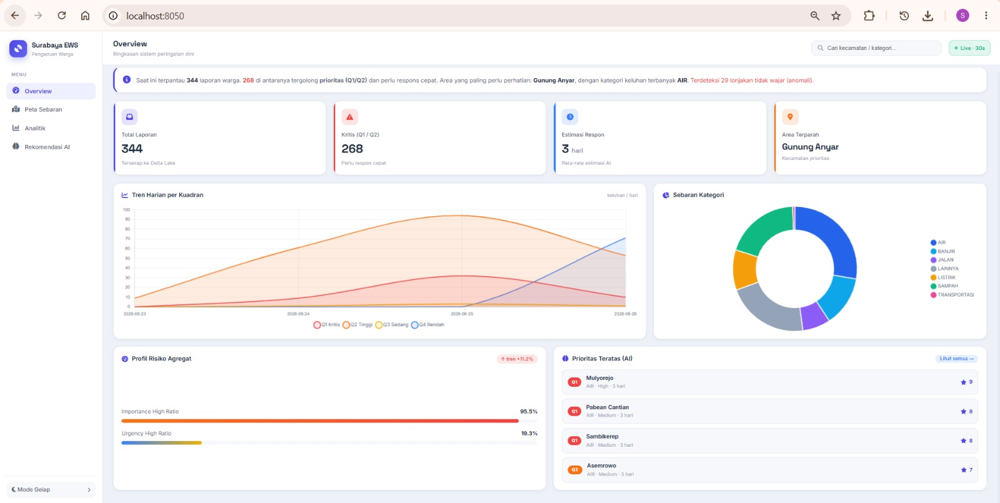
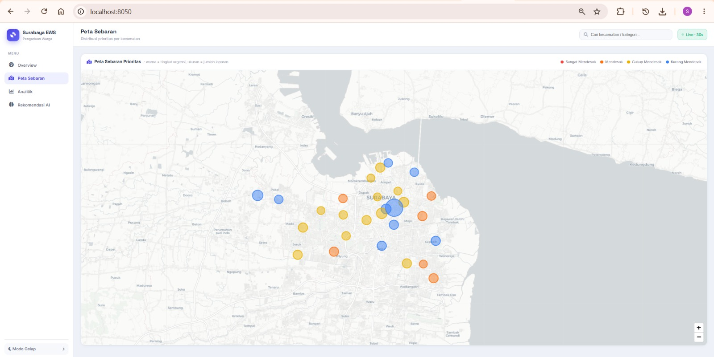
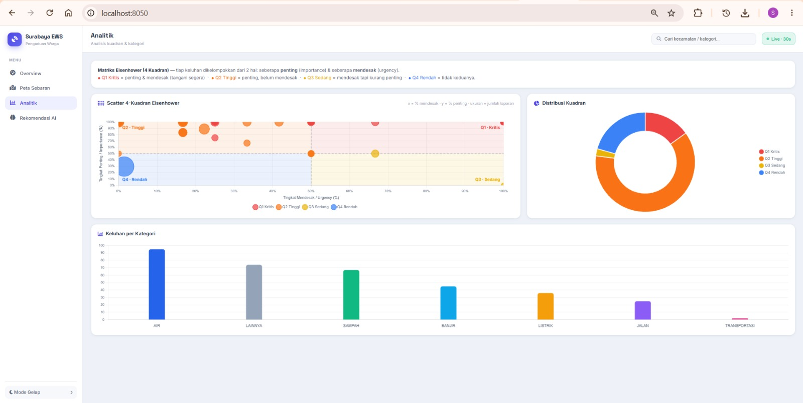
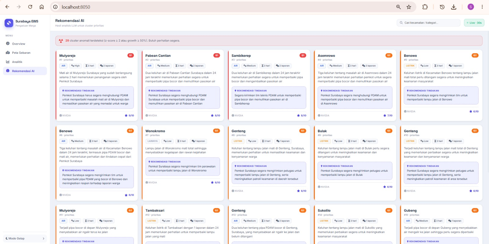
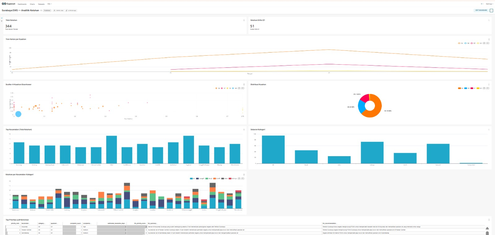
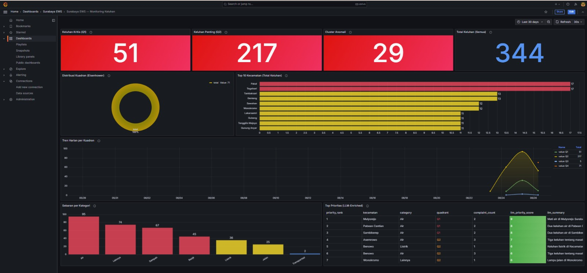

# Surabaya Complaint Early Warning System

Sistem Peringatan Dini Keluhan Publik Berbasis Big Data

Final Project — Big Data (C_K2) - Departemen Teknologi Informasi, ITS Surabaya - 2026

---

## Anggota Kelompok

| Nama | NRP | Role |
|---|---|---|
| Hafiz | 5027241096 | Infrastruktur Engineer |
| Salsa | 5027241052 | Ingestion Engineer |
| Zaenal | 5027241018 | ML Engineer |
| Angga | 5027241062 | Pipeline + LLM Engineer |
| Shinta | 5027241016 | Visualization + Laporan |

---

## Deskripsi Proyek

Sistem ini mengumpulkan, memproses, dan menganalisis keluhan publik dari berbagai sumber media digital (berita online, media sosial, dan platform video) untuk menghasilkan peringatan dini berbasis prioritas bagi pemerintah Kota Surabaya.

Data keluhan diproses melalui pipeline Big Data berlapis (Medallion Architecture: Bronze - Silver - Gold), diklasifikasikan menggunakan model Machine Learning, diperkaya dengan rekomendasi dari LLM, lalu divisualisasikan melalui dashboard interaktif yang ter-update berkala.

---

## Arsitektur Sistem

Lakehouse dengan pola Medallion. Orkestrasi pipeline dilakukan melalui script loop (`run_continuous` / `run_pipeline`), bukan scheduler terpisah, agar ringan dan reproducible.

```
+---------------------------------------------------------------------------+
|                              SUMBER DATA                                  |
|     RSS Berita    X (Twitter)    Reddit    YouTube    Threads             |
+--------------------------------+------------------------------------------+
                                 |  Python Scraper
                                 v
+---------------------------------------------------------------------------+
|                  INGESTION - Apache Kafka (KRaft)                         |
|     Topic: raw-rss | raw-x | raw-reddit | raw-yt | raw-threads           |
+--------------------------------+------------------------------------------+
                                 |  Spark Structured Streaming / Batch
                                 v
+---------------------------------------------------------------------------+
|              BRONZE - Delta Lake @ MinIO (s3a://bronze/)                  |
|     Data mentah, as-is, append-only, format Delta (time travel)          |
+--------------------------------+------------------------------------------+
                                 |  Spark Batch (silver_transform.py)
                                 v
+---------------------------------------------------------------------------+
|              SILVER - Delta Lake @ MinIO (s3a://silver/)                  |
|     Teks bersih + skor awal + NER kecamatan                              |
|     + ML inference (predict_batch.py) -> category/importance/urgency      |
+--------------------------------+------------------------------------------+
                                 |  Spark Batch (gold_aggregate.py)
                                 v
+---------------------------------------------------------------------------+
|              GOLD - Delta Lake @ Hive Metastore (s3a://gold/)            |
|     Agregasi harian per kecamatan & kategori + label 4-kuadran           |
|     + LLM Enrichment (llm_enrichment.py) -> rekomendasi tindakan          |
+--------------------------------+------------------------------------------+
                                 |  Trino SQL Engine
                                 v
+---------------------------------------------------------------------------+
|                               SERVING                                     |
|     Superset (analitik)   Grafana (monitoring)   FastAPI Custom Dashboard |
+---------------------------------------------------------------------------+

Katalog metadata : Hive Metastore (PostgreSQL backend)
Pelacakan model  : MLflow (artefak di MinIO)
Orkestrasi       : Script loop (run_continuous / run_pipeline)
```

> *Tambahkan diagram arsitektur di `docs/img/01-arsitektur.png`*

---

## Stack Teknologi

| Layer | Teknologi | Versi | Peran |
|---|---|---|---|
| Ingestion | Apache Kafka (KRaft) | 3.9.0 | Message broker, decoupling scraper - prosesor |
| Storage | MinIO | latest | Object storage S3-compatible (lokal) |
| Format | Delta Lake | 3.2.0 | ACID + time travel di atas object storage |
| Processing | Apache Spark | 3.5.3 | Batch & streaming ETL + ML inference |
| ML | Spark MLlib | - | Classifier kategori, importance, urgency |
| Anomaly | z-score (>2 sigma) / Isolation Forest | - | Deteksi lonjakan keluhan abnormal |
| LLM | NVIDIA NIM / Gemini (fallback chain) | - | Enrichment rekomendasi tindakan |
| Catalog | Hive Metastore | 4.0.0 | Katalog metadata terpusat (PostgreSQL backend) |
| Query Engine | Trino | 455 | SQL analitik interaktif ke layer Gold |
| ML Tracking | MLflow | v2.17.2 | Eksperimen model, versioning, artefak |
| Serving | Superset / Grafana | 4.1.1 / 11.3.0 | Dashboard analitik + monitoring |
| Backend | FastAPI + Uvicorn | - | Custom dashboard server |
| Orchestration | Script loop (PowerShell/Python) | - | Penjadwalan & loop pipeline |
| Infra | Docker Compose | - | Reproducible single-file deployment |

---

## Struktur Repositori

```
C_K2_FP_BIG-DATA_2026/
|
├── docker-compose.yml          # Seluruh stack dalam satu file
├── .env.example                # Template environment variable
├── HOW_TO_RUN.md               # Panduan menjalankan (fresh clone & restart)
├── README.md
|
├── ingestion/
│   ├── scrapers/
│   │   ├── rss_scraper.py          # RSS (Detik Jatim, BeritaJatim, Kompas SBY)
│   │   ├── base_scraper.py         # Base class + skema standar Bronze
│   │   ├── sources_config.py       # Daftar sumber + keyword filter
│   │   └── social_media/
│   │       ├── reddit_scraper.py
│   │       ├── x_scraper.py
│   │       ├── youtube_scraper.py      # YouTube Data API v3
│   │       ├── threads_playwright.py   # Threads (Meta) via Playwright
│   │       └── simpan_login_threads.py # Simpan sesi login Threads
│   ├── run_rss_to_kafka.py
│   └── run_social_to_kafka.py
|
├── kafka/
│   └── producer.py             # Wrapper KafkaProducer
|
├── spark/
│   ├── bronze_ingest.py            # Kafka -> Bronze (streaming)
│   ├── bronze_ingest_once.py       # Kafka -> Bronze (one-shot)
│   ├── silver_transform.py         # Bronze -> Silver (NLP cleaning + scoring)
│   ├── gold_aggregate.py           # Silver scored -> Gold (agregasi 4-kuadran)
│   └── ml/
│       ├── train_classifier.py     # Classifier 7 kategori
│       ├── train_importance.py     # Classifier importance (tinggi/rendah)
│       ├── train_urgency.py        # Classifier urgency (tinggi/rendah)
│       ├── train_anomaly.py        # Isolation Forest anomaly detection
│       └── predict_batch.py        # Batch inference Silver -> Silver scored
|
├── llm/
│   ├── llm_client.py               # Wrapper LLM + fallback chain
│   ├── llm_enrichment.py           # Gold Q1/Q2 -> LLM-Gold enrichment
│   └── prompt_templates.py         # Template prompt structured output
|
├── dashboard_server.py         # FastAPI server dashboard custom (port 8050)
├── templates/index.html        # UI dashboard (multipage + Leaflet + Chart.js)
├── requirements-dashboard.txt
|
├── superset/
│   ├── bootstrap.py            # Auto-provision DB + dataset + chart + dashboard
│   └── superset_config.py
|
├── grafana/provisioning/
│   ├── datasources/trino.yaml
│   └── dashboards/surabaya-ews-monitoring.json
|
├── data/                       # Dataset berlabel untuk training
├── hive/                       # metastore-site.xml + lib JAR (lihat catatan)
├── trino/catalog/delta.properties
├── docs/                       # architecture.md + pipeline_llm_guide.md
└── run_pipeline.ps1 / run_continuous.ps1 / .py / .sh
```

Catatan: file `hive/lib/*.jar`, folder `.ivy/`, dan `.env` tidak ikut ke repo (gitignore). Cara melengkapinya dijelaskan di `HOW_TO_RUN.md`.

---

## Cara Menjalankan

Panduan ringkas (Windows + PowerShell). Untuk langkah lengkap, lihat `HOW_TO_RUN.md`.

### Prasyarat
- Docker Desktop (WSL2 di Windows), RAM kosong minimal 8 GB (16 GB disarankan)
- Python 3.9+ (untuk dashboard custom)
- Port bebas: 9000, 9001, 9083, 9092, 9094, 8080, 8081, 8088, 3000, 5001, 8050

### 1. Setup awal
```powershell
git clone https://github.com/shintaar123/C_K2_FP_BIG-DATA_2026.git
cd C_K2_FP_BIG-DATA_2026
copy .env.example .env        # isi NVIDIA_API_KEY bila ingin LLM (opsional)
```

Lengkapi 3 JAR Hive yang tidak ikut ter-clone (gitignore karena besar):
```powershell
New-Item -ItemType Directory -Force -Path hive/lib | Out-Null
Invoke-WebRequest "https://repo1.maven.org/maven2/org/postgresql/postgresql/42.7.4/postgresql-42.7.4.jar"            -OutFile "hive/lib/postgresql-42.7.4.jar"
Invoke-WebRequest "https://repo1.maven.org/maven2/org/apache/hadoop/hadoop-aws/3.3.6/hadoop-aws-3.3.6.jar"           -OutFile "hive/lib/hadoop-aws-3.3.6.jar"
Invoke-WebRequest "https://repo1.maven.org/maven2/com/amazonaws/aws-java-sdk-bundle/1.12.367/aws-java-sdk-bundle-1.12.367.jar" -OutFile "hive/lib/aws-java-sdk-bundle-1.12.367.jar"
```

### 2. Nyalakan stack
```powershell
docker compose up -d
docker compose ps            # tunggu semua healthy
```

### 3. Dependency Spark + pipeline penuh
```powershell
docker compose exec spark-master bash -c "pip install -q feedparser==6.0.11 kafka-python-ng==2.2.3 requests==2.32.3 beautifulsoup4==4.12.3 python-dotenv==1.0.1 mlflow==2.17.2 boto3 urllib3==1.26.20"

docker compose exec spark-master python3 /opt/spark/work-dir/ingestion/run_rss_to_kafka.py
docker compose exec spark-master python3 /opt/spark/work-dir/ingestion/run_social_to_kafka.py

.\run_pipeline.ps1 -Ingest -Train     # Bronze -> Train -> Silver -> Predict -> Gold -> Anomaly -> LLM
```

### 4. Dashboard
```powershell
docker start -a superset-bootstrap     # bangun dashboard Superset

python -m venv .venv                   # dashboard custom (terminal baru)
.\.venv\Scripts\Activate.ps1
pip install -r requirements-dashboard.txt
python dashboard_server.py
```

### 5. Mode autonomous (opsional)
```powershell
.\run_continuous.ps1 -IntervalSeconds 1800     # loop tiap 30 menit
```

---

## Akses Dashboard & Layanan

| Layanan | URL | Login | Keterangan |
|---|---|---|---|
| Dashboard Custom | http://localhost:8050 | - | FastAPI + Leaflet + Chart.js (utama) |
| Superset | http://localhost:8088 | admin / admin | Dashboard analitik |
| Grafana | http://localhost:3000 | admin / admin | Monitoring + alert visual |
| MinIO Console | http://localhost:9001 | minioadmin / minioadmin123 | Object storage |
| Spark UI | http://localhost:8080 | - | Monitoring job Spark |
| Trino UI | http://localhost:8081 | - | Query engine |
| MLflow | http://localhost:5001 | - | Tracking model |

---

## Model Machine Learning

```
Dataset berlabel
   ├── train_classifier.py   -> Kategori (7 kelas)
   ├── train_importance.py   -> Importance (tinggi/rendah)
   └── train_urgency.py      -> Urgency (tinggi/rendah)
          |
          v   (model + metrik di-log ke MLflow, artefak di MinIO)
   predict_batch.py   -> Batch inference Silver -> Silver scored
          |
          v
   train_anomaly.py   -> Isolation Forest (deteksi lonjakan per grup)
```

- Model 1 - Category Classifier: TF-IDF + classifier, 7 kategori keluhan (Air, Sampah, Jalan, Listrik, Banjir, Transportasi, Lainnya). Metrik & confusion matrix di-log ke MLflow.
- Model 2 - Importance Classifier: biner (tinggi/rendah), seberapa berdampak keluhan terhadap kepentingan publik.
- Model 3 - Urgency Classifier: biner (tinggi/rendah), seberapa mendesak keluhan perlu ditangani.
- Anomaly Detection: Isolation Forest per grup (kecamatan x kategori) berbasis time-series Gold. Sementara flag anomali menggunakan z-score (>2 sigma) sambil menunggu histori cukup.

---

## Sistem Prioritas - Matriks Eisenhower 4 Kuadran

Setiap kombinasi (kecamatan, kategori, hari) diberi label kuadran berdasarkan rasio `importance_high_ratio` dan `urgency_high_ratio` dalam grup (ambang 0.5).

```
                    URGENCY
                Tinggi        Rendah
            +-------------+-------------+
   Tinggi   |     Q1      |     Q2      |
IMPORTANCE  | PRIORITAS   |  PENTING    |
            |   UTAMA     | TERENCANA   |
            +-------------+-------------+
   Rendah   |     Q3      |     Q4      |
            |  SEGERA     |  TUNDA /    |
            | DIDELEGASI  |  MONITOR    |
            +-------------+-------------+
```

| Kuadran | Importance | Urgency | Deskripsi | Tindakan |
|---|---|---|---|---|
| Q1 | Tinggi | Tinggi | Penting & Mendesak | Respons segera |
| Q2 | Tinggi | Rendah | Penting, tidak mendesak | Jadwalkan |
| Q3 | Rendah | Tinggi | Mendesak, kurang penting | Delegasikan |
| Q4 | Rendah | Rendah | Tidak keduanya | Monitor |

Skor prioritas dasar di tabel Gold (`priority_score_base`):

```
priority_score_base = (avg_importance * 0.4)
                    + (avg_urgency    * 0.4)
                    + (complaint_count / max_complaint_count) * 0.2
```

---

## LLM Enrichment

Hanya cluster berkuadran Q1 dan Q2 (maksimum 20 cluster prioritas tertinggi per run) yang dikirim ke LLM untuk diperkaya rekomendasi tindakan. Ini menghemat kuota API dan menjaga fokus pada keluhan yang benar-benar berdampak.

### Fallback Chain (Zero Crash Guarantee)
```
Gemini 2.5 Flash
    | gagal / key kosong
    v
NVIDIA NIM (Llama 3.3 70B, OpenAI-compatible)
    | gagal
    v
Groq (Llama 3.3 70B)
    | gagal
    v
Cerebras (Llama 3.3 70B)
    | gagal
    v
Rule-based fallback (tanpa LLM, pipeline tidak pernah crash)
```

### Output LLM-Gold (gold.complaint_enriched)
| Field | Keterangan |
|---|---|
| complexity | Tingkat kompleksitas penanganan |
| estimated_resolution_days | Estimasi hari penyelesaian |
| llm_recommendation | Langkah konkret yang direkomendasikan |
| llm_priority_score | Skor prioritas dari perspektif LLM |
| llm_summary | Ringkasan situasi keluhan |
| llm_provider | Provider LLM yang dipakai |
| priority_rank | Peringkat prioritas antar-cluster |

Catatan privasi: LLM hanya menerima data agregat Gold + maksimum 3 contoh teks per cluster, bukan data individual mentah.

---

## Dashboard Custom (FastAPI)

Dashboard utama dibangun dengan FastAPI (backend, membaca Delta Lake langsung via library `deltalake`) dan Leaflet.js + Chart.js (frontend). Tampilan berupa aplikasi multi-halaman dengan sidebar navigasi, mendukung mode terang/gelap (light/dark toggle), dan auto-refresh tiap 30 detik.

### Halaman
- Overview: ringkasan satu kalimat, KPI (total laporan, kritis Q1/Q2, estimasi respons, area terparah), tren harian per kuadran, sebaran kategori, profil risiko agregat, dan preview rekomendasi AI teratas.
- Peta Sebaran: peta Surabaya (Leaflet). Warna marker mengikuti tingkat urgensi (merah = sangat mendesak hingga biru = kurang mendesak), ukuran marker = jumlah laporan. Popup menampilkan total laporan, jumlah laporan prioritas, serta rasio importance & urgency.
- Analitik: scatter plot 4-kuadran Eisenhower (sumbu x = urgency, y = importance, dengan latar 4 zona kuadran berwarna + garis pembatas), distribusi kuadran, dan bar chart keluhan per kategori.
- Rekomendasi AI: kartu detail hasil LLM untuk tiap cluster prioritas (ringkasan, rekomendasi tindakan, kompleksitas, estimasi hari, skor prioritas, provider). Dilengkapi pencarian.

Warna kategori konsisten di seluruh chart. Dashboard mencakup 31 kecamatan Surabaya (ditambah kategori "Tidak Diketahui" untuk lokasi yang tidak terdeteksi).









---

## Skema Data

### Bronze - s3a://bronze/news_raw (Delta Lake)
Data mentah as-is dari scraper (skema seragam semua sumber):
```
id            STRING      -- id unik (hash dari url/sumber)
source_type   STRING      -- rss | x | reddit | youtube | threads
source_name   STRING      -- detik_jatim | reddit | youtube_search | ...
raw_text      STRING      -- judul + isi/snippet
author        STRING
url           STRING
likes         INT
shares        INT
published_at  STRING      -- ISO 8601
scraped_at    STRING      -- ISO 8601
```

### Silver - s3a://silver/news_silver & news_scored (Delta Lake)
```
... field Bronze ...
clean_text          STRING   -- teks setelah normalisasi
kecamatan           STRING   -- hasil NER lokasi (kecamatan Surabaya)
importance_score    FLOAT
urgency_score       FLOAT
category            STRING   -- hasil model (7 kelas)
importance_label    STRING   -- tinggi | rendah
urgency_label       STRING   -- tinggi | rendah
```

### Gold - gold.complaint_daily (Delta via Hive Metastore)
```
date                        DATE
kecamatan                   STRING
category                    STRING
complaint_count             INT
avg_importance              FLOAT
avg_urgency                 FLOAT
importance_high_ratio       FLOAT
urgency_high_ratio          FLOAT
quadrant                    STRING   -- Q1 | Q2 | Q3 | Q4
complaint_growth_rate_3day  FLOAT
is_anomaly                  BOOLEAN
priority_score_base         FLOAT
```

### LLM-Gold - gold.complaint_enriched (Delta via Hive Metastore)
```
... field complaint_daily ...
complexity                  STRING
estimated_resolution_days   INT
llm_recommendation          STRING
llm_priority_score          INT
llm_summary                 STRING
llm_provider                STRING   -- gemini | nvidia | groq | cerebras | rule-based
priority_rank               INT
```

### Verifikasi via Trino
```sql
SHOW TABLES FROM delta.gold;

SELECT kecamatan, category, quadrant, complaint_count, priority_score_base
FROM delta.gold.complaint_daily
ORDER BY priority_score_base DESC
LIMIT 20;

SELECT kecamatan, category, llm_recommendation, estimated_resolution_days
FROM delta.gold.complaint_enriched
WHERE quadrant = 'Q1'
ORDER BY priority_rank
LIMIT 10;
```





---

## Justifikasi Arsitektur

- Mengapa Kafka (bukan langsung ke Spark): Kafka menjadi buffer dan decoupler. Saat terjadi lonjakan keluhan, scraper tetap bisa menulis tanpa membebani Spark; data tertahan di Kafka hingga siap diproses. Mode KRaft (tanpa Zookeeper) menyederhanakan deployment.
- Mengapa Delta Lake (bukan Parquet biasa): memberikan transaksi ACID, schema enforcement, dan time travel di atas object storage murah, sehingga Bronze dapat append dan Silver/Gold dapat overwrite dengan jaminan konsistensi.
- Mengapa Trino (bukan langsung Spark): Trino dioptimasi untuk query analitik interaktif latensi rendah, sehingga dashboard dapat membaca layer Gold dalam hitungan detik tanpa menjalankan Spark job.
- Mengapa LLM hanya untuk Q1 dan Q2: alasan biaya dan latensi. Hanya keluhan berdampak tinggi yang layak dianalisis lebih dalam, sehingga kuota API hemat.
- Mengapa orkestrasi via script (bukan Airflow): untuk skala proyek ini, script loop sudah memenuhi kebutuhan menjalankan tahapan berurutan dan berulang, tanpa overhead service scheduler tambahan. Definisi urutan tahap menjaga dependency antar-langkah.

---

## Pemetaan ke Materi Kuliah

| Komponen | Teknologi | Minggu |
|---|---|---|
| Message Broker | Apache Kafka | 7 |
| Object Storage | MinIO | 4 / 9 |
| Processing Engine | Apache Spark | 5 |
| Storage Format | Delta Lake (Medallion) | 10 |
| ML Library | Spark MLlib | 6 / 13 |
| ML Tracking | MLflow | 13 |
| Orchestration | Script loop (run_continuous) | 12 |
| Data Catalog | Hive Metastore | 11 |
| Query Engine | Trino | 14 |
| Dashboard | Superset + Grafana + Custom | 14 |

---

## Keandalan & Skalabilitas

- Reproducibility: seluruh stack didefinisikan dalam satu `docker-compose.yml` dengan versi image yang dikunci.
- Pemisahan storage & compute: data di MinIO, compute di Spark/Trino; compute dapat di-scale tanpa memindahkan data.
- Graceful degradation: kegagalan satu sumber scraper tidak menjatuhkan pipeline lain; data tertahan di Kafka.
- Zero-crash LLM pipeline: fallback chain 4 provider + rule-based memastikan enrichment tidak pernah gagal total.
- Dependency management: menggunakan image resmi (Apache, MinIO, Grafana) untuk keberlanjutan jangka panjang.

---

## Environment Variables

Salin `.env.example` ke `.env` lalu isi:

```
# MinIO
MINIO_ROOT_USER=minioadmin
MINIO_ROOT_PASSWORD=minioadmin123

# Hive Metastore (PostgreSQL backend)
HIVE_PG_USER=hive
HIVE_PG_PASSWORD=hivepassword
HIVE_PG_DB=metastore

# Superset
SUPERSET_SECRET_KEY=<string acak minimal 32 karakter>

# LLM API Keys (opsional - isi minimal satu; tanpa key tetap jalan via rule-based)
GEMINI_API_KEY=
NVIDIA_API_KEY=
GROQ_API_KEY=
CEREBRAS_API_KEY=

# YouTube Data API v3 (untuk scraper YouTube)
YOUTUBE_API_KEY=
```

---

## Lampiran: Daftar Screenshot untuk Laporan

Simpan file gambar di folder `docs/img/` dengan nama berikut agar placeholder di README otomatis terisi:

| No | Nama File | Isi yang difoto |
|---|---|---|
| 1 | 01-arsitektur.png | Diagram arsitektur sistem |
| 2 | 02-docker-ps.png | `docker compose ps` semua container healthy |
| 3 | 03-pipeline-selesai.png | Terminal saat pipeline selesai (PIPELINE SELESAI) |
| 4 | 04-mlflow.png | MLflow UI: experiment + metrik model |
| 5 | 05-dashboard-overview.png | Dashboard custom - Overview (mode terang) |
| 6 | 06-dashboard-peta.png | Dashboard custom - Peta Sebaran + popup kecamatan |
| 7 | 07-dashboard-analitik.png | Dashboard custom - Analitik (scatter 4-kuadran) |
| 8 | 08-dashboard-ai.png | Dashboard custom - Rekomendasi AI |
| 9 | 09-dashboard-dark.png | Dashboard custom - mode gelap (opsional) |
| 10 | 10-trino-query.png | Hasil query Gold (Trino UI / Superset SQL Lab) |
| 11 | 11-superset.png | Superset - dashboard analitik |
| 12 | 12-grafana.png | Grafana - dashboard monitoring |
| 13 | 13-minio.png | MinIO Console - bucket bronze/silver/gold/mlflow |

Disarankan menambah screenshot pendukung bila perlu: Spark UI (job berjalan), Kafka topic, serta contoh isi tabel `complaint_enriched`.
